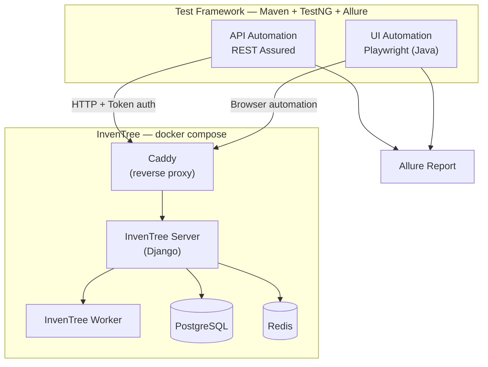
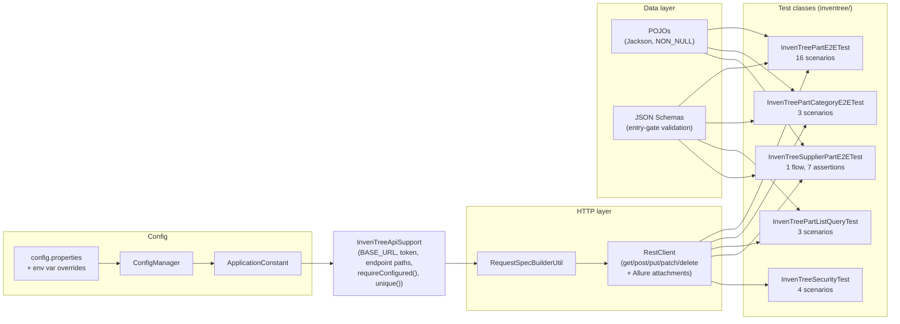
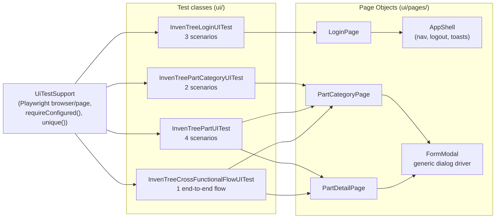
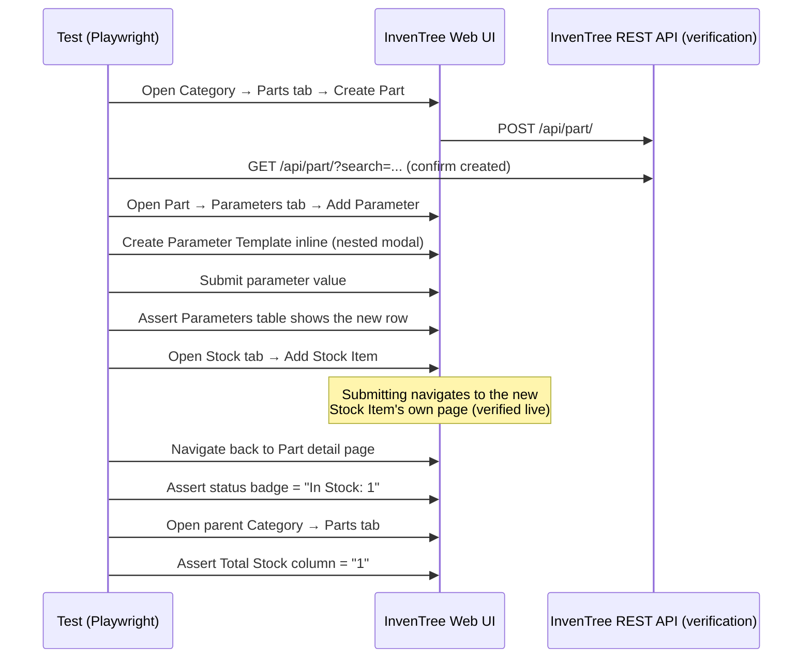

# EPAM API Framework — InvenTree Test Automation

An API + UI test automation suite built against [InvenTree](https://inventree.org/), an open-source
inventory management system, covering the **Part**, **Part Category**, and **Supplier/Company**
resources end-to-end. Built as part of an EPAM API/AI automation assignment: manual test case
design, REST Assured API automation, and Playwright UI automation, all runnable from one Maven
project.

> If you're new to this repo, start here, then see [`CLAUDE.md`](CLAUDE.md) for the conventions to
> follow when extending it.

## Contents

- [What's in this repo](#whats-in-this-repo)
- [Architecture](#architecture)
- [Project structure](#project-structure)
- [Test coverage](#test-coverage)
- [Getting started](#getting-started)
- [Running the tests](#running-the-tests)
- [Reports](#reports)
- [Notable design decisions](#notable-design-decisions)

## What's in this repo

| Deliverable | Where | Format |
|---|---|---|
| API manual test cases | [`test-cases/api-manual-test-cases.csv`](test-cases/api-manual-test-cases.csv) | 43 cases, CSV |
| UI manual test cases | [`test-cases/ui-manual-test-cases.csv`](test-cases/ui-manual-test-cases.csv) | 24 cases, CSV |
| API automation | `src/test/java/inventree/` | REST Assured + TestNG, 27 executable scenarios |
| UI automation | `src/test/java/ui/` | Playwright (Java) + TestNG, 10 executable scenarios |
| Agent conventions | [`CLAUDE.md`](CLAUDE.md) | Rules for extending this suite consistently |

Every automated scenario and every manual test case was written from **behavior verified against a
live InvenTree instance** — not guessed from documentation. Where that verification turned up
something non-obvious (an API quirk, a UI framework limitation), it's called out inline in the code
and summarized in [Notable design decisions](#notable-design-decisions).

## Architecture

### System overview

The test suite drives InvenTree two ways — over HTTP directly (API layer) and through a real
browser (UI layer) — against the same Dockerized InvenTree stack, with results collected into one
Allure report.



### API automation layer

One `RestClient` for every HTTP call (it attaches request/response/status to Allure automatically),
one `<Resource>ApiSupport` class per external system holding config/auth/skip-guard logic, and one
E2E test class per resource.



### UI automation layer (Page Object Model)

One generic `FormModal` drives *every* InvenTree create/edit dialog — it's built on a stable
`aria-label` convention InvenTree uses for form fields (`text-field-name`, `number-field-...`,
`boolean-field-...`), so it never needed a bespoke Page Object per modal.



### Example flow: the cross-functional scenario

`InvenTreeCrossFunctionalFlowUITest` — create a Part, add a Parameter (creating its Template
inline), add Stock, then confirm the stock is visible both on the Part page and aggregated in the
parent Category's Parts table.



## Project structure

```
src/test/java/
  client/          RestClient           — thin static HTTP wrapper; all calls go through it
  specifications/  RequestSpecBuilderUtil — builds RestAssured RequestSpecification objects
  constant/        ApplicationConstant  — config key names + defaults
  files/           ConfigManager        — property/env loading (env vars override file values)
  pojo/            Request/response POJOs, one per API resource
  inventree/       InvenTreeApiSupport + one API E2E test class per resource
  ui/              InvenTree UI test classes, one per feature/flow
  ui/pages/        Playwright Page Object classes (incl. the generic FormModal)
  utils/           DB / JSON / retry / auth helpers
  main/            Pre-existing ReqRes/SWAPI/H2 practice exercises (unrelated to InvenTree)

src/test/resources/
  config.properties        default/local config (secrets redacted; see Getting started)
  schema/*.json            JSON Schema files, one per API resource shape (list + detail)

test-cases/
  api-manual-test-cases.csv   43 manual API test cases
  ui-manual-test-cases.csv    24 manual UI test cases

inventree-docker/          docker-compose stack for running InvenTree locally
```

## Test coverage

### API manual test cases (43) — [`api-manual-test-cases.csv`](test-cases/api-manual-test-cases.csv)

| Area | Cases |
|---|---|
| Part CRUD (positive + negative) | 11 |
| Category CRUD (positive, negative, relational integrity, boundary) | 9 |
| List filtering / search / pagination | 4 |
| Field-level validation (boundaries + null handling) | 8 |
| Relational integrity (category, location, supplier linkage) | 5 |
| Edge cases (unauthorised access, invalid payloads) | 6 |

### UI manual test cases (24) — [`ui-manual-test-cases.csv`](test-cases/ui-manual-test-cases.csv)

| Area | Cases |
|---|---|
| Login / logout | 4 |
| Navigation | 2 |
| Category CRUD | 4 |
| Part CRUD + Part Actions menu | 7 |
| Parameters | 2 |
| Stock | 2 |
| Cross-functional flow (create → parameter → stock → category view) | 1 |
| List search / navigation | 2 |

### API automation (27 executable scenarios)

| Class | Covers |
|---|---|
| `InvenTreePartE2ETest` | Part CRUD flow (create/retrieve/patch/put/delete, read-only field protection), field-length boundaries (IPN/description/keywords/notes), `default_expiry` range, explicit-null handling, `units` as a registered physical unit |
| `InvenTreePartCategoryE2ETest` | Category CRUD, parent/child hierarchy, the `delete_parts`/`delete_child_categories` cascade contract, name-length boundary |
| `InvenTreePartListQueryTest` | Search, category filtering, `limit`/`offset` pagination on `GET /api/part/` |
| `InvenTreeSupplierPartE2ETest` | Company + SupplierPart relational integrity: valid linkage, non-supplier-company rejection, duplicate-SKU conflict |
| `InvenTreeSecurityTest` | GET/POST with no credentials and with an invalid token → 401 |

### UI automation (10 executable scenarios)

| Class | Covers |
|---|---|
| `InvenTreeLoginUITest` | Valid login, logout, incorrect-password rejection |
| `InvenTreePartCategoryUITest` | Category creation (positive + blank-name validation) |
| `InvenTreePartUITest` | Part creation, validation, editing, Delete-disabled-while-active |
| `InvenTreeCrossFunctionalFlowUITest` | The full create → parameter → stock → category-view flow |

## Getting started

### Prerequisites

- Java 15, Maven
- Docker (to run InvenTree locally via `inventree-docker/docker-compose.yml`)
- Google Chrome or any Chromium-based browser installed locally (Playwright manages its own
  browser binary — see below — but a system browser helps for manual UI exploration)

### 1. Start InvenTree

```bash
cd inventree-docker
cp .env.example .env   # if present; otherwise create .env with your own local values
docker compose up -d
```

InvenTree will be reachable at `http://localhost` once the stack is healthy.

### 2. Install Playwright's browser (one-time)

```bash
mvn dependency:build-classpath -Dmdep.outputFile=/tmp/cp.txt -Dmdep.includeScope=test
java -cp "$(cat /tmp/cp.txt)" com.microsoft.playwright.CLI install chromium
```

### 3. Configure

All configuration goes through `src/test/resources/config.properties`, with every key
overridable by an environment variable (dotted key `inventree.base.url` ↔ env var
`INVENTREE_BASE_URL`, env vars take priority). The committed file ships with placeholders —
replace them locally or export the matching env vars:

```properties
inventree.base.url=http://localhost:80
inventree.api.token=REPLACE_WITH_YOUR_INVENTREE_API_TOKEN
inventree.ui.username=REPLACE_WITH_YOUR_INVENTREE_UI_USERNAME
inventree.ui.password=REPLACE_WITH_YOUR_INVENTREE_UI_PASSWORD
```

Any suite that needs these skips itself cleanly (`SkipException`) if they're left unset — `mvn test`
never fails just because InvenTree isn't running.

## Running the tests

```bash
mvn -Pinventree test    # API E2E suites only (27 scenarios)
mvn -Pui test           # Playwright UI suites only (10 scenarios)
mvn -Pall test          # everything, including the pre-existing ReqRes/SWAPI/H2 exercises
```

Run a single class:

```bash
mvn -Pinventree -Dtest=InvenTreePartE2ETest test
```

Debug a UI test with a visible browser instead of headless:

```bash
mvn -Pui -Dui.headless=false -Dtest=InvenTreeLoginUITest test
```

## Reports

```bash
mvn allure:report
open target/site/allure-maven-plugin/index.html
```

Every API call is attached to Allure as request/response/status evidence; every UI scenario's
class-level Javadoc cites the manual test case ID it automates (e.g. `UI-FLOW-001`), so the two
deliverables stay traceable to each other.

## Notable design decisions

- **Schema validation as an entry gate.** Every API E2E class validates the endpoint's response
  schema in `@BeforeClass` before any CRUD scenario runs — if the API contract changed, the suite
  fails fast with a clear reason instead of failing confusingly deep into a flow.
- **Single-flow E2E for stateful resources, independent tests for stateless checks.** Part/Category/
  SupplierPart CRUD share created IDs and prior response state across one ordered flow (matching how
  a real business process touches a record). List queries and security checks don't need that shared
  state, so they're plain independent `@Test` methods instead of being forced into the same shape.
- **One generic `FormModal` instead of one Page Object per dialog.** InvenTree's UI consistently
  labels form fields `aria-label="<type>-field-<name>"` — verified directly against the running app
  — so a single driver against that convention covers every create/edit modal in the product.
- **API-driven test-data setup/teardown for UI tests.** UI suites create and delete their fixtures
  (Categories, Parts) via the API layer, not by driving the UI — faster, more reliable, and it keeps
  each UI test focused on the specific behavior it's actually verifying.
- **Bugs found by running against a live instance, not by guessing.** Several assumptions turned out
  wrong when actually executed — e.g. submitting "Add Stock Item" navigates to the new Stock Item's
  own page rather than back to the Part, and a zero-stock Part displays "No stock" in the Category
  view rather than "0". Both are handled explicitly in the code rather than left as silent bugs.

See [`CLAUDE.md`](CLAUDE.md) for the full conventions to follow when adding new suites.
